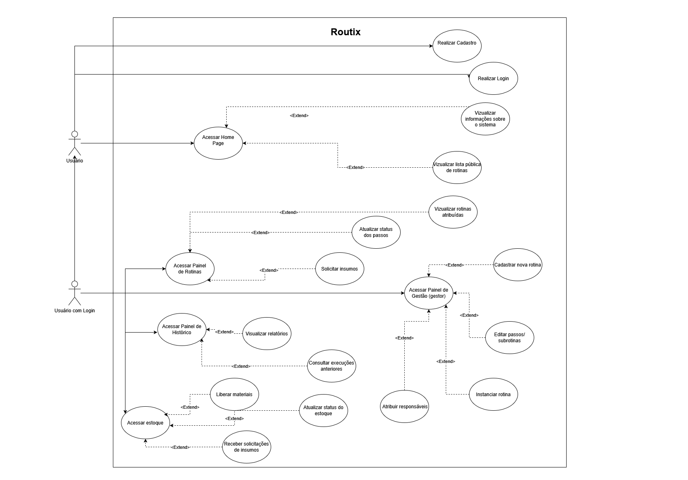

# Especificação do projeto

As personas representam perfis fictícios baseados em usuários reais que podem interagir com a aplicação. Elas são elaboradas para entender melhor as necessidades, desafios e objetivos do público-alvo, auxiliando no desenvolvimento de soluções mais eficazes e alinhadas com a realidade dos usuários.

## Personas

1. Paula – Gestora de Produção

    Idade: 42 anos

    Ocupação: Coordenadora de produção em uma indústria têxtil

    Contexto: Paula coordena uma equipe de 30 operadores e precisa garantir que todas as rotinas de produção ocorram no prazo e sem erros.
   
 2. Lucas – Técnico de Manutenção

    Idade: 28 anos

    Ocupação: Técnico de manutenção em uma fábrica de alimentos

    Contexto: Lucas executa manutenções programadas e precisa seguir checklists rigorosos. Ele reclama que perde tempo buscando insumos no almoxarifado.

3. Fernanda – Analista de Qualidade

    Idade: 35 anos

    Ocupação: Responsável por auditorias e controle de qualidade

    Contexto: Fernanda precisa garantir que todas as etapas das rotinas estejam sendo seguidas e documentadas corretamente para fins de certificação.

4. Bruno – Gerente de TI

    Idade: 39 anos

    Ocupação: Gerente de tecnologia de uma empresa de logística

    Contexto: Bruno quer automatizar tarefas repetitivas e padronizar processos da equipe técnica com rotinas digitais.

5. Camila – Assistente Administrativa

    Idade: 25 anos

    Ocupação: Auxiliar administrativa em escritório de engenharia

    Contexto: Camila organiza a rotina de pagamentos, agendamento de reuniões e controle de insumos para o escritório, mas não tem uma ferramenta centralizada.

6. Rafael – Diretor de Operações

    Idade: 50 anos

    Ocupação: Diretor de operações em uma rede de franquias

    Contexto: Rafael quer acompanhar, de forma macro, a execução das rotinas nas unidades franqueadas e verificar onde há gargalos.
7. Tatiane – Consultora de Processos

    Idade: 46 anos

    Ocupação: Consultora externa de melhoria de processos

    Contexto: Tatiane presta serviço de auditoria e melhoria de processos em diversas empresas. Ela frequentemente mapeia fluxos em ferramentas como BPMN e precisa de uma solução que permita não apenas documentar, mas testar e acompanhar esses fluxos em tempo real nas empresas-clientes.

 8. Igor – Estagiário de Engenharia

    Idade: 21 anos

    Ocupação: Estagiário de engenharia em uma metalúrgica

    Contexto: Igor está aprendendo sobre processos internos e é constantemente encarregado de tarefas simples dentro de rotinas maiores. Ele precisa de clareza sobre o que deve fazer, prazos e como cada passo se encaixa no todo.

9.  Patrícia – Especialista em Suprimentos
    
    Idade: 38 anos
    
    Ocupação: Especialista de Suprimentos em uma rede de restaurantes.
    
    Contexto: Patrícia é responsável por garantir que as unidades tenham todos os ingredientes e materiais necessários para a operação diária. Ela lida com múltiplos fornecedores e prazos, e a falta de integração entre as necessidades de consumo das cozinhas e o estoque tem gerado desperdício e falta de itens.

10. Gustavo – Coordenador de Projetos
    Idade: 45 anos
    
    Ocupação: Coordenador de Projetos em uma empresa de desenvolvimento de software.
    
    Contexto: Gustavo gerencia projetos complexos que envolvem várias equipes e dependências. Ele precisa de uma forma clara de visualizar o progresso de cada fase do projeto, identificar gargalos entre as tarefas e garantir que os recursos (tempo e equipe) sejam alocados de forma eficiente.

11. Mariana – Gerente de Recursos Humanos
    
    Idade: 33 anos
    
    Ocupação: Gerente de RH em uma empresa de consultoria.
    
    Contexto: Mariana é responsável pelos processos de onboarding de novos colaboradores, que envolvem diversas etapas e departamentos (TI, financeiro, administrativo). Ela busca uma forma padronizada e transparente de garantir que todas as etapas sejam cumpridas, desde a documentação até o acesso a sistemas e treinamentos.

12. Roberto – Empreendedor/Dono de Pequeno Negócio
    
    Idade: 48 anos
    
    Ocupação: Dono de uma pequena fábrica de móveis planejados.
    
    Contexto: Roberto gerencia a produção, vendas e instalação dos móveis. Ele tem poucos funcionários e precisa de uma ferramenta simples e acessível para organizar as etapas de cada pedido (do projeto à entrega), controlar os materiais utilizados e saber o status de cada cliente sem ter que perguntar a cada funcionário.

    13. Gabriel – Supervisor de Logística
    Idade: 40 anos
    Ocupação: Supervisor de logística em uma empresa de e-commerce.
    Contexto: Gabriel é responsável pela coordenação de rotas de entrega e recebimento de mercadorias. Ele enfrenta desafios para garantir que os veículos estejam com a manutenção em dia, que os insumos (combustível, peças) estejam disponíveis e que os motoristas sigam os checklists de carregamento e descarregamento, impactando a eficiência e os prazos de entrega.

14. Laura – Gerente de Facilities
    Idade: 37 anos
    Ocupação: Gerente de Facilities em um prédio corporativo multi-empresarial.
    Contexto: Laura gerencia diversas rotinas de manutenção predial, limpeza, segurança e controle de acesso. Ela precisa de uma forma de padronizar os procedimentos para as equipes de serviço, monitorar o cumprimento das tarefas e garantir que os materiais de limpeza e ferramentas de manutenção estejam sempre em estoque e prontos para uso.

15. Daniel – Coordenador de Equipe de Campo
    Idade: 32 anos
    Ocupação: Coordenador de uma equipe de técnicos de instalação e reparo de telecomunicações.
    Contexto: Daniel gerencia uma equipe que realiza visitas diárias a clientes para instalações e reparos. Ele precisa ter certeza de que cada técnico tenha as ferramentas e peças corretas para cada chamado, que os procedimentos de instalação sejam seguidos consistentemente e que o histórico de cada serviço seja registrado para referência futura e auditoria.

## Histórias de usuários

Com base na análise das personas, foram identificadas as seguintes histórias de usuários:

|EU COMO |PRECISO |PARA |
|--------------------|-------------------------------------|----------------------------------------|
|Gestora de Produção|criar e acompanhar rotinas de produção com subtarefas e insumos|garantir que minha equipe siga os procedimentos corretamente e não falte materiais.|
|Técnico de manutenção|ter acesso às rotinas com seus passos e insumos listados|não atrasar a execução das tarefas e garantir que tudo esteja disponível quando eu começar|
|Analista de Qualidade|acessar o histórico das execuções de rotinas|aprofundar meus conhecimentos na área de endocrinologia e suas complexidades|
|Gerente de TI|cadastrar rotinas com frequência definida (diária, semanal, etc.)|validar se os processos foram cumpridos conforme o padrão e gerar relatórios para auditoria|
|Assistente administrativa|acompanhar várias instâncias da mesma rotina (como “fechamento financeiro mensal”)|manter tudo organizado e saber o que já foi feito em cada mês|
|Diretor de operações|visualizar o status das rotinas em andamento com filtros por responsáveis e categorias|identificar problemas operacionais rapidamente e agir de forma estratégica|
|Consultora de processos|modelar rotinas como templates reutilizáveis e acompanhar sua execução|aplicar melhorias e padronizações nas empresas onde atuo com base em dados reais|
|Estagiário de engenharia| visualizar apenas os passos e tarefas que me foram atribuídos dentro das rotinas|executar corretamente minhas atividades sem confusão, mesmo sem experiência prévia|
| Especialista em Suprimentos | ser notificada automaticamente sobre a necessidade de reposição de insumos com base no consumo das rotinas | garantir que as unidades tenham os itens necessários e evitar desperdícios ou falta de produtos. |
| Coordenador de Projetos  | visualizar o progresso de cada etapa de um projeto complexo, com dependências entre tarefas | identificar gargalos rapidamente e otimizar a alocação de recursos e prazos.           |
| Gerente de Recursos Humanos | criar e gerenciar checklists padronizados para processos de onboarding de novos colaboradores | garantir que todas as etapas sejam cumpridas de forma consistente e transparente.       |
| Empreendedor/Dono de Pequeno Negócio | acompanhar o status de cada pedido/projeto, desde a entrada até a entrega, com controle de materiais | ter uma visão clara da operação e saber o que precisa ser feito para cada cliente.      |
| Supervisor de Logística       | acompanhar o status da manutenção de veículos e o consumo de insumos por rota | otimizar a frota e garantir que as entregas ocorram sem interrupções.                  |
| Gerente de Facilities         | padronizar e monitorar as rotinas de manutenção e suprimento de materiais | garantir a qualidade dos serviços e a disponibilidade de recursos para as equipes.     |
| Coordenador de Equipe de Campo| registrar o histórico de cada serviço e controlar o uso de ferramentas e peças por técnico | assegurar a qualidade das instalações/reparos e o controle eficiente do estoque de campo. |

## Requisitos

As tabelas que se seguem apresentam os requisitos funcionais e não funcionais que detalham o escopo do projeto.

### Requisitos Funcionais

| ID      | Descrição do Requisito | Prioridade |
|---------|------------------------|------------|
| RF-001  | Permitir que o usuário se cadastre na plataforma | ALTA |
| RF-002  | Permitir que o usuário faça login na plataforma | ALTA |
| RF-003  | Os usuários podem cadastrar uma rotina ou processo | ALTA |
| RF-004  | Alterar, Adicionar e Remover tarefas de sua rotina ou processo | ALTA |
| RF-005  | Alterar, Adicionar e Remover sub-rotinas/sub-provessos a sua rotina ou processo | MÉDIA |
| RF-006  | Iniciar uma rotina ou processo cadastrado | ALTA |
| RF-007  | Alterar uma rotina ou processo em adamento | ALTA |
| RF-008  | Adicionar comentarios a tarefas e a sub-rotinas/sub-processos | MÉDIA |
| RF-009  | Visualizar o historico de uma rotina ou processo em adamento | MÉDIA |
| RF-010  | Visualizar o historico de rotinas e processos finalizados | ALTA |
| RF-011  | Alterar, Adicionar e Remover uma tarefa de uma rotina ou processo em andamento | MÉDIA |
| RF-012  | Alterar, Adicionar e Remover uma sub-rotina/sub-processo de uma rotina ou processo em andamento | MÉDIA |
| RF-013  | Adicionar e Remover recursos a uma tarefa de uma rotina ou processo | MÉDIA |
| RF-014  | Adicionar e Remover recursos a uma tarefa de uma rotina ou processo em andamento | MÉDIA |
| RF-015  | Alterar, Adicionar e Remover recursos/insumos | BAIXA |
| RF-016  | Alterar quantidade de recursos/insumos disponiveis ao iniciar uma tarefa | BAIXA |
| RF-017  | Alterar quantidade de recursos/insumos disponiveis ao finalizar uma tarefa | BAIXA |
| RF-018  | Bloquear tarefa por falta de recursos/insumos | BAIXA |
| RF-019  | Visualizar rotinas em execução com filtros por responsável, status, tipo e datas | BAIXA |
| RF-020  | Gerar relatório de tempo | BAIXA |
| RF-021  | Gerar relatório de insumos | BAIXA |

### Requisitos não Funcionais

|ID     | Descrição do Requisito  |Prioridade |
|-------|-------------------------|----|
|RNF-001| A aplicação deve estar disponível 24 horas por dia | ALTA |
|RNF-002| Deve processar requisições do usuário em no máximo 3s |  BAIXA |
|RNF-003| O sistema deve armazenar dados do usuário | ALTA |
|RNF-004| O sistema deve exibir o conteúdo com base nas permissões e papéis dos usuários | ALTA |
|RNF-005| O sistema deve ser responsivo e funcionar em dispositivos móveis e desktops | ALTA |

## Restrições

Enumere as restrições à sua solução. Lembre-se de que as restrições geralmente limitam a solução candidata.

O projeto está restrito aos itens apresentados na tabela a seguir.

|ID| Restrição                                             |
|--|-------------------------------------------------------|
|001| O projeto deverá ser entregue até o final do semestre |
|002| O custo total do projeto não deve exceder o orçamento definido       |

## Diagrama de casos de uso

