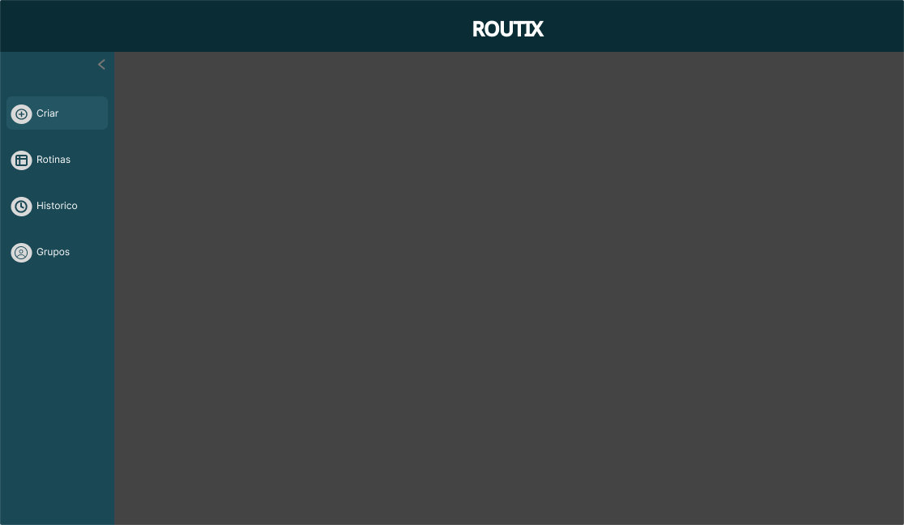
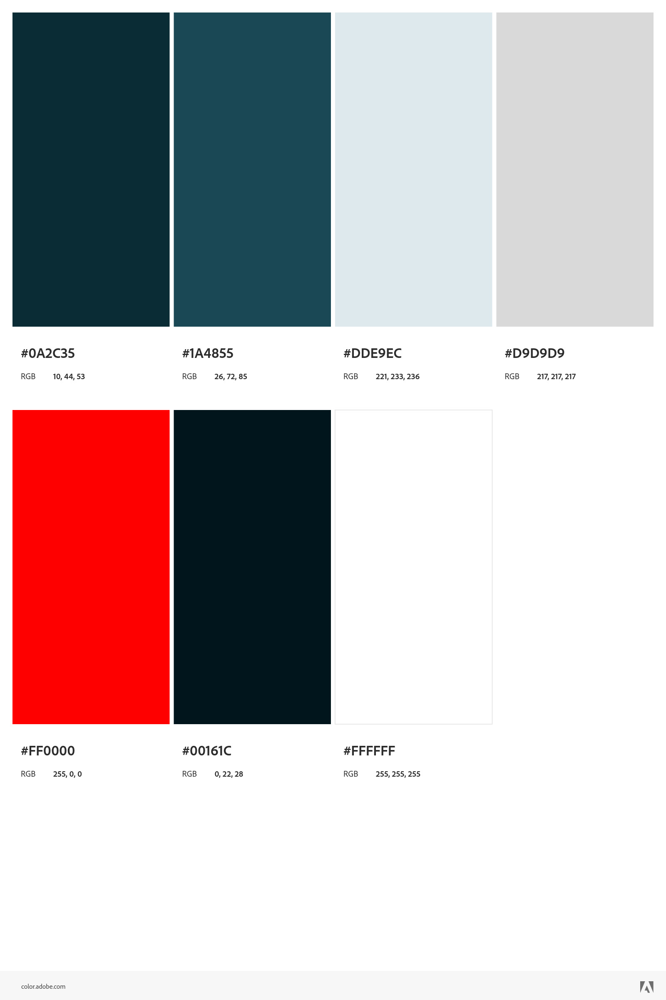

# Template padrão da aplicação

Pré-requisitos: <a href="02-Especificacao.md"> Especificação do projeto</a>, <a href="03-Metodologia.md"> Metodologia</a>, <a href="05-Projeto-interface.md"> Projeto de interface</a>

Layout padrão da aplicação que será utilizado em todas as páginas com a definição de identidade visual, aspectos de responsividade e iconografia.

## Cores
Observa-se que a paleta de cores foi usada por um padrão de cores usadas na área industrial

### Paleta de cores da aplicação

## Tipografia

Fontes utilizadas: [Inter](https://fonts.google.com/specimen/Inter?query=inter)

A fonte tipográfica adotada foi Inter, selecionada por sua legibilidade, estética neutra e ampla aceitação no mercado corporativo e digital. Trata-se de uma fonte sans-serif moderna, que oferece boa leitura em diferentes tamanhos e dispositivos, sendo amplamente utilizada em interfaces de usuário (UI) e materiais profissionais devido à sua clareza e versatilidade.

## Logo

O ícone foi desenhado para refletir o objetivo da aplicação, tendo um aspecto mais minimalista e simples representando o nome e o foco do sistema em gerenciar rotinas. Ademais, junto a representção do lápis na logo, ela representa a funcionalidade principal da aplicação: organizar, padronizar e otimizar rotinas empresariais.

## Iconografia

- [SearchIcon](https://mui.com/material-ui/material-icons/?query=search&selected=Search) - Indicar input para pesquisa de artigos e recursos da aplicação
- [AccessTimeIcon](https://mui.com/material-ui/material-icons/?query=clock&selected=AccessTime) - Indicar botão que exibe o histórico
- [AddCircleIcon](https://mui.com/material-ui/material-icons/?query=plus&selected=AddCircleOutline) - Indicar botão para criação de tarefa
- [AccountCircleIcon](https://mui.com/material-ui/material-icons/?query=user&theme=Outlined&selected=AccountCircleOutlined) - Indicar botão que exibe os grupos
- [TrashIcon](https://mui.com/material-ui/material-icons/?query=trash&selected=DeleteOutline) - Indicar botão de excluir rotina
- [AddIcon](https://mui.com/material-ui/material-icons/?query=add&selected=Add) - Indicar botão para criação de rotina
- [CheckBoxIcon](https://mui.com/material-ui/material-icons/?theme=Outlined&selected=CheckBoxOutlined) - Indicar botão de expandir tarefa
- [DashBoardIcon](https://mui.com/material-ui/material-icons/?query=dash&theme=Outlined&selected=SpaceDashboardOutlined) - Indicar botão para exibir rotinas 
