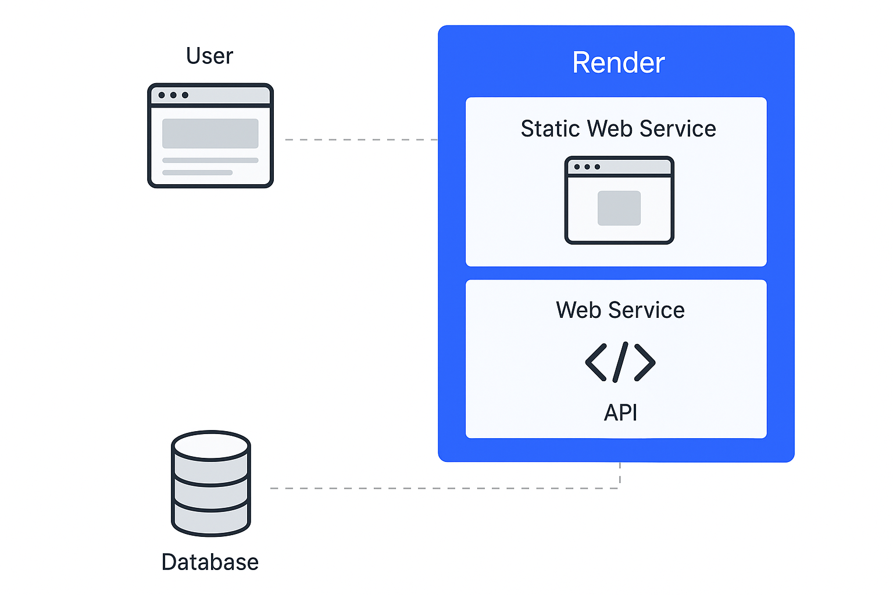
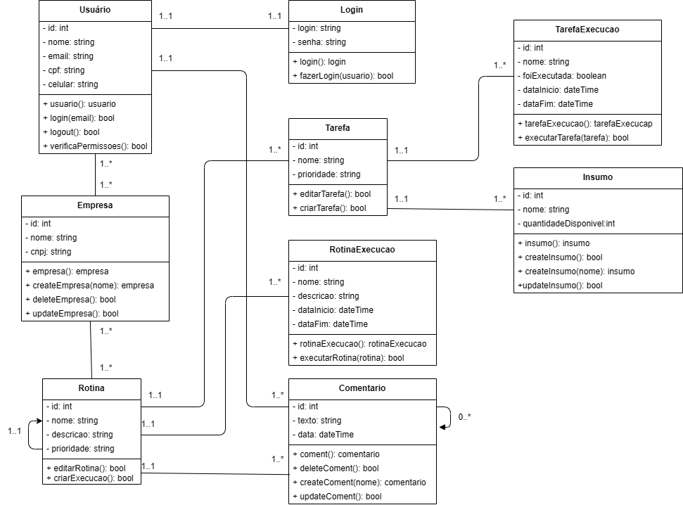
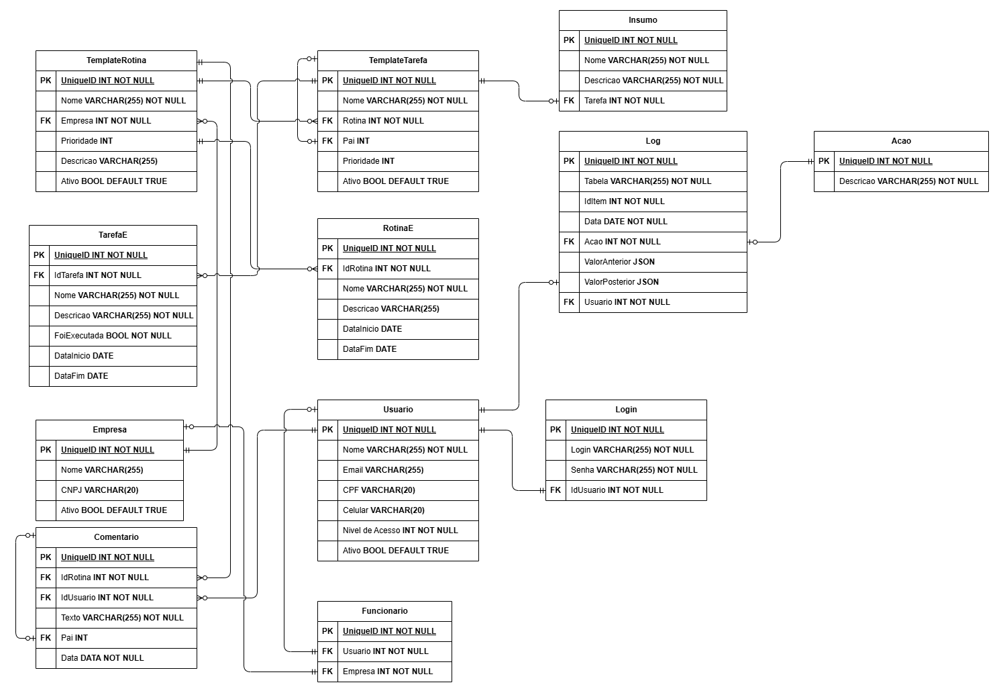
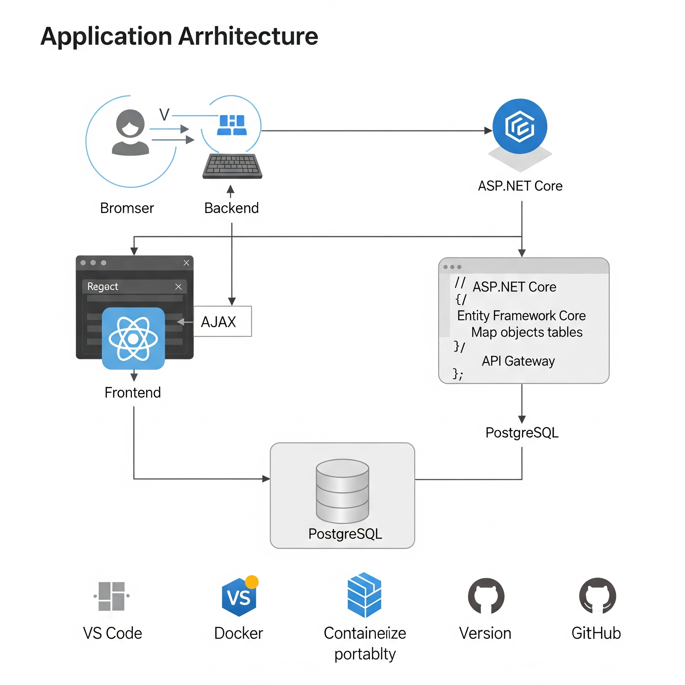

# Arquitetura da solução

<span style="color:red">Pré-requisitos: <a href="05-Projeto-interface.md"> Projeto de interface</a></span>

A aplicação foi desenvolvida com base em uma arquitetura modular, composta por três principais camadas:

#### 1. **Frontend** (`/src/front`)
- Desenvolvido com **React** e **TypeScript**.
- Utiliza **Tailwind CSS** para estilização.
- Navegação controlada via **React Router**.
- Gerenciamento de pacotes com `npm` (`package.json`, `package-lock.json`).
- Arquivos de configuração e build com suporte a **Docker** (`Dockerfile`).
- Preparado para ser servido como **SPA (Single Page Application)**.

#### 2. **Backend** (`/src/back`)
- Desenvolvido com **ASP.NET Core (.NET 7)**.
- Utiliza o **Entity Framework Core** para acesso ao banco de dados.
- Arquitetura orientada a serviços com configurações via `Program.cs` e `appsettings.json`.
- Inclui suporte a **migrações de banco** via `MigrationManager.cs`.
- Contêinerizado com **Docker** e pronto para orquestração com `docker-compose`.

#### 3. **Banco de Dados**
- Banco relacional (ex: **PostgreSQL** ou **SQL Server**).
- Configurado por meio do Entity Framework Core.
- Suporte a versionamento de schema via migrações.
- Hospedado na Render ou em serviço externo compatível.



## Diagrama de classes



O diagrama de classes ilustra graficamente a estrutura do software e como cada uma das classes estará interligada. Essas classes servem de modelo para materializar os objetos que serão executados na memória.

##  Modelo de dados

O desenvolvimento da solução proposta requer a existência de bases de dados que permitam realizar o cadastro de dados e os controles associados aos processos identificados, assim como suas recuperações.

Utilizando a notação do DER (Diagrama Entidade-Relacionamento), elabore um modelo, usando alguma ferramenta, que contemple todas as entidades e atributos associados às atividades dos processos identificados. Deve ser gerado um único DER que suporte todos os processos escolhidos, visando, assim, uma base de dados integrada. O modelo deve contemplar também o controle de acesso dos usuários (partes interessadas nos processos) de acordo com os papéis definidos nos modelos do processo de negócio.

Apresente o modelo de dados por meio de um modelo relacional que contemple todos os conceitos e atributos apresentados na modelagem dos processos.

### Modelo ER

O Modelo ER representa, por meio de um diagrama, como as entidades (coisas, objetos) se relacionam entre si na aplicação interativa.


### Esquema relacional

O Esquema Relacional corresponde à representação dos dados em tabelas juntamente com as restrições de integridade e chave primária.
 


---

### Modelo físico

Insira aqui o script de criação das tabelas do banco de dados.

Veja um exemplo:

```sql
CREATE TABLE EMPRESA(
	ID INT AUTO_INCREMENT PRIMARY KEY,
	Nome VARCHAR(255) NOT NULL,
	CNPJ VARCHAR(20),
	Ativo BOOLEAN DEFAULT TRUE,
	INDEX idx_empresa_nome (Nome),
	INDEX idx_empresa_cpnj (CNPJ)
);

CREATE TABLE TEMPLATE_ROTINA(
	ID INT AUTO_INCREMENT PRIMARY KEY,
	Nome VARCHAR(255) NOT NULL,
	Empresa INT NOT NULL,
	Prioridade INT,
	Descricao VARCHAR(255),
	Ativo BOOLEAN DEFAULT TRUE,
	FOREIGN KEY (Empresa) REFERENCES EMPRESA(ID),
	INDEX idx_template_rotina_nome (Nome)
);

CREATE TABLE TEMPLATE_TAREFA(
	ID INT AUTO_INCREMENT PRIMARY KEY,
	Nome VARCHAR(255) NOT NULL,
	Rotina INT NOT NULL,
	Pai INT,
	Prioridade INT,
	Ativo BOOLEAN DEFAULT TRUE,
	FOREIGN KEY (Rotina) REFERENCES TEMPLATE_ROTINA(ID) ON DELETE CASCADE,
	FOREIGN KEY (Pai) REFERENCES TEMPLATE_TAREFA(ID) ON DELETE CASCADE,
	INDEX idx_template_tarefa_nome (Nome)
);

CREATE TABLE INSUMO(
	ID INT AUTO_INCREMENT PRIMARY KEY,
	Nome VARCHAR(255) NOT NULL,
	Descricao INT NOT NULL,
	Tarefa INT NOT NULL,
	FOREIGN KEY (Tarefa) REFERENCES TEMPLATE_TAREFA(ID) ON DELETE CASCADE,
	INDEX idx_insumo_nome (Nome)
);

CREATE TABLE TAREFA(
	ID INT AUTO_INCREMENT PRIMARY KEY,
	Tarefa INT NOT NULL,
	Nome VARCHAR(255) NOT NULL,
	Foi_Executada TINYINT(1),
	DataInicio DATE,
	DataFim Date,
	FOREIGN KEY (Tarefa) REFERENCES TEMPLATE_TAREFA(ID)
	INDEX idx_tarefa_data_inicio (DataInicio),
	INDEX idx_tarefa_data_fim (DataFim)
);

CREATE TABLE ROTINA(
	ID INT AUTO_INCREMENT PRIMARY KEY,
	Rotina INT NOT NULL,
	Nome VARCHAR(255) NOT NULL,
	Descricao VARCHAR(255),
	DataInicio DATE,
	DataFim DATE,
	FOREIGN KEY (Rotina) REFERENCES TEMPLATE_ROTINA(ID),
	INDEX idx_rotina_nome (Nome),
	INDEX idx_rotina_data_inicio (DataInicio),
	INDEX idx_rotina_data_fim (DataFim)
);

CREATE TABLE USUARIO(
	ID INT AUTO_INCREMENT PRIMARY KEY,
	Nome VARCHAR(255) NOT NULL,
	Email VARCHAR(255),
	CPF VARCHAR(20),
	Celular VARCHAR (20),
	Nivel_Acesso INT,
	Ativo BOOLEAN DEFAULT TRUE,
	INDEX idx_usuarui_nome (Nome),
	INDEX idx_usuario_email (Email),
	INDEX idx_usuario_cpf (CPF)
);

CREATE TABLE LOGIN(
	ID INT AUTO_INCREMENT PRIMARY KEY,
	Login VARCHAR(255) NOT NULL,
	Senha VARCHAR(255) NOT NULL,
	Usuario INT NOT NULL,
	FOREIGN KEY (Usuario) REFERENCES USUARIO(ID) ON DELETE CASCADE,
	INDEX idx_login_login (Login)
);

CREATE TABLE COMENTARIO(
	ID INT AUTO_INCREMENT PRIMARY KEY,
	Rotina INT NOT NULL,
	Usuario INT NOT NULL,
	Texto VARCHAR(255) NOT NULL,
	Pai INT,
	DataComentario DATE,
	FOREIGN KEY (Rotina) REFERENCES ROTINA(ID) ON DELETE CASCADE,
	FOREIGN KEY (Usuario) REFERENCES USUARIO(ID) ON DELETE SET NULL,
	FOREIGN KEY (Pai) REFERENCES COMENTARIO(ID),
	INDEX idx_comentario_data (DataComentario)
);

CREATE TABLE ACAO(
	ID INT AUTO_INCREMENT PRIMARY KEY,
	Descricao VARCHAR(255) NOT NULL
);

CREATE TABLE LOGS(
	ID INT AUTO_INCREMENT PRIMARY KEY,
	Tabela VARCHAR(255) NOT NULL,
	IdItem INT NOT NULL,
	DataLog DATE NOT NULL,
	Acao INT NOT NULL,
	ValorAnterior JSON,
	ValorPosterior JSON,
	Usuario INT NOT NULL,
	FOREIGN KEY (Acao) REFERENCES ACAO(ID),
	FOREIGN KEY (Usuario) REFERENCES USUARIO(ID),
	INDEX idx_logs_tabela (Tabela)
);

CREATE TABLE FUNCIONARIO(
	ID INT AUTO_INCREMENT PRIMARY KEY,
	Usuario INT NOT NULL,
	Empresa INT NOT NULL,
	FOREIGN KEY (Usuario) REFERENCES USUARIO(ID),
	FOREIGN KEY (Empresa) REFERENCES EMPRESA(ID)
);
```
Esse script deverá ser incluído em um arquivo .sql na pasta [de scripts SQL](../src/db).


## Tecnologias

A solução foi desenvolvida utilizando um conjunto moderno de tecnologias que visam garantir desempenho, manutenibilidade e escalabilidade. O frontend foi implementado em **React** com **TypeScript**, proporcionando uma aplicação web dinâmica e fortemente tipada. A estilização da interface foi feita com **Tailwind CSS**, que permite construir rapidamente componentes responsivos com um conjunto de classes utilitárias.

No backend, a aplicação utiliza **ASP.NET Core**, um framework robusto e multiplataforma baseado em **C#**, responsável por fornecer uma API REST que interage com o banco de dados. Para o mapeamento objeto-relacional, foi adotado o **Entity Framework Core**, que facilita as operações sobre dados relacionais utilizando modelos da aplicação.

A infraestrutura da aplicação conta com a utilização de **Docker**, permitindo o empacotamento padronizado dos serviços e facilitando a implantação em ambientes homogêneos. O **Docker Compose** também é utilizado para orquestrar a execução local dos serviços, como o backend e o banco de dados. O projeto é versionado com **GitHub**, que também serve como base para o deploy contínuo via integração com o serviço de hospedagem **Render**. Esse ambiente hospeda tanto o frontend (como site estático) quanto o backend (como serviço web dinâmico), ambos configurados a partir de contêineres Docker. O banco de dados relacional utilizado é o **PostgreSQL**, conectado diretamente à API.

As principais ferramentas de desenvolvimento incluem o **Visual Studio Code** como IDE principal, o **.NET CLI** para gerenciamento e execução do backend, além do **npm** para controle de pacotes do frontend.

## Fluxo de Interação do Usuário com o Sistema

O fluxo de interação do sistema inicia com o usuário acessando o site por meio do navegador, carregando o frontend hospedado na plataforma Render. A interface, construída em React, emite requisições HTTP (via `fetch` ou bibliotecas similares) para a API desenvolvida em ASP.NET Core. A API processa essas requisições, realizando validações, regras de negócio e, quando necessário, consultas ou alterações no banco de dados relacional PostgreSQL utilizando o Entity Framework Core. As respostas da API, geralmente no formato JSON, retornam ao frontend, que então atualiza dinamicamente a interface do usuário com base nas informações recebidas.




| **Dimensão**   | **Tecnologia**  |
| ---            | ---             |
| Front-end      | HTML + CSS + JS + React |
| Back-end       | Node.js         |
| SGBD           | MySQL           |
| Deploy         | Render          |


## Hospedagem

A aplicação foi preparada para deployment utilizando contêineres Docker, com um `Dockerfile` localizado na raiz do backend. Esse arquivo define a imagem base da aplicação .NET, instala dependências necessárias, copia os arquivos do projeto e define o comando de inicialização. Foram criados arquivos de configuração como `appsettings.json` e `appsettings.Development.json`, que permitem separar variáveis sensíveis e adaptar comportamentos da aplicação conforme o ambiente (desenvolvimento ou produção).

A hospedagem foi realizada na plataforma Render. Uma conta foi criada e um serviço do tipo “Web Service” foi configurado. O projeto foi conectado diretamente ao Render por meio do GitHub. No momento da configuração, foi especificado que o método de build seria baseado no `Dockerfile`, permitindo ao Render construir a imagem automaticamente. Variáveis de ambiente essenciais, como a string de conexão com o banco de dados e chaves secretas, foram adicionadas na seção “Environment” da interface de gerenciamento da plataforma.

Durante o processo de deploy, o Render realiza o build da imagem Docker com base no repositório conectado. Após o build, o container é executado e a aplicação é exposta na porta definida pelo projeto, sendo disponibilizada por uma URL pública fornecida automaticamente pela plataforma.

O banco de dados foi provisionado separadamente — podendo estar dentro do Render ou em um serviço externo compatível com o Entity Framework Core. As credenciais de acesso ao banco foram configuradas como variáveis de ambiente, garantindo a segurança e isolamento entre os ambientes. A separação entre configurações de produção e desenvolvimento foi mantida por meio dos arquivos de configuração e do suporte do Render à definição de variáveis específicas por ambiente.


## Qualidade de software

A qualidade do software foi avaliada com base na norma ISO/IEC 25010, que define atributos essenciais para garantir que o sistema atenda às necessidades dos usuários e mantenedores. A equipe considerou aspectos como usabilidade, desempenho, manutenibilidade, segurança e portabilidade.

A usabilidade é priorizada devido à interface acessível via navegador, o sistema foi feito para que os usúarios tem a a fácil compreensão e utilização, especialmente em tarefas como login e cadastro. No que diz respeito ao desempenho e à eficiência, o sistema prioriza garantir respostas rápidas e uso adequado de recursos, visto que o frontend e o backend estão hospedados na Render. 

A manutenibilidade é favorecida por uma arquitetura modular e organizada, com uso de Docker e separação entre camadas. Quanto à segurança, a proteção de dados sensíveis e o controle de acesso são fundamentais, considerando os processos de autenticação do sistema. Forão usados ferramentas como o OWASP ZAP e avaliado o número de falhas de autenticação.

Por fim, a portabilidade é assegurada pelo uso de contêineres e plataformas em nuvem, o que facilita a execução do sistema em diferentes ambientes. Forão consideradas a duração dos processos de build e deploy e a compatibilidade entre os ambientes locais e remotos.

Essa abordagem visa garantir que o software mantenha altos padrões de qualidade em seus aspectos funcionais e não funcionais, alinhando-se às boas práticas propostas pela norma ISO/IEC 25010.
