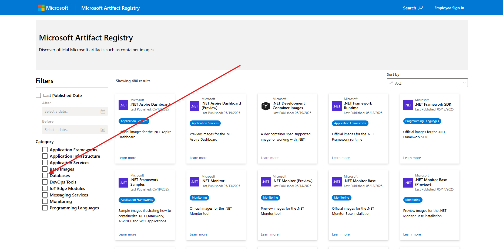

Utilizamos sql_server para nosso banco de dados, e executamos o banco via docker.

# Pré-Requisitos

## Instalação do WSL
Tenha certeza que o WSL esteja em sua maquina para o docker poder rodar sem problemas

- Você pode ir para pagina da microsoft que explica sobre esse processo [Download WSL](https://learn.microsoft.com/pt-br/windows/wsl/install)
- Ou simplesmente rodar o seguinte comando no terminal/PowerShell
```PowerShell 
wsl --install
```

## Instalação do Docker
Tenha certeza de que você possui o Docker instalado em sua maquina, caso não tenha você pode fazer o download por aqui [Download Docker](https://www.docker.com/products/docker-desktop/)

## Download da imagem do SQL_Server
Faça o download da imagem do SQL_Server pelo site da propria microsoft [Microsoft Artifact Registry](https://mcr.microsoft.com), em caso de duvidas segue um passo de como fazer esse download;

<ins>A partir do link filtre por "**Database**"</ins>


<ins>Selecione "**Microsoft SQL Server - Ubuntu based images**"</ins>


<ins>Em "tags" procure pela release "2022-latest" e copie o comando docker</ins>


<ins>Rode o comando docker em um terminal</ins>

# Subida do banco

## Subir a imagem no docker

Para a subida da imagem docker pode ser feita rodando o seguinte comando em um terminal
```PoweShell
docker run -e "ACCEPT_EULA=Y" -e "MSSQL_SA_PASSWORD=Routix123321!" -p 1433:1433  --name routix_db --hostname routix -d mcr.microsoft.com/mssql/server:2022-latest
```

## Conexão ao banco
A conexão ao banco pode variar entre SGBDs então segue os parametros comuns a eles, para a realizar a conexão basta fazer a composição desses parametros para seu SGBD

- URL: jdbc:sqlserver://;serverName=localhost;databaseName=master
- HOST: localhost
- Porta: 1433
- Banco de dados/esquema: master
- Autenticação: SQL Server Authentication
- Nome de Usuario: sa
- Senha: Routix123321!

## Criação de tabelas
Nesta pasta você encontra-ra um arquivo DDL.sql contendo o script para a criação de todas as tabelas de acordo com a modelagem previamente proposta, basta abrir o arquivo em seu SGBD, ou copiar o script diretamente, e executa-lo no banco

## População do banco
Ainda será criado um arquivo DML.sql contendo o script para população inicial do banco
